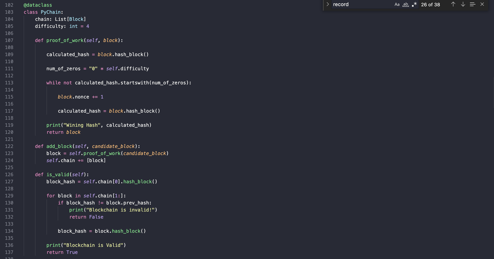

# *Blockchain Ledger*
---

**Welcome to my repository for the blockchain-based ledger system. Please explore the codebase!** <br />

---
## Analytical Summary

This project builds a blockchain-based ledger system and applies it to a user-friendly web interface. The ledger allows participants to conduct financial transactions and to verify the integrity of the data in the ledger.

---

## Technologies

This project leverages python 3.7 with the following packages:

* [pandas](https://pandas.pydata.org) - Library for reading/writing csv files and fast manipulation with DataFrames.

* [streamlit](https://streamlit.io/) - Library to build and share data apps.

* [dataclasses](https://docs.python.org/3/library/dataclasses.html) - Module that provides a decorator and functions for automatically adding methods to user-defined classes.
Note: Python 3.7 already includes dataclasses, Python 3.6 does not.

* [typing](https://docs.python.org/3/library/typing.html) - Module that provides support for type hints.

* [datetime](https://docs.python.org/3/library/datetime.html) - Library that supplies classes for manipulating dates and times.

* [hashlib](https://docs.python.org/3/library/hashlib.html) - This module implements a common interface to many different secure hash and message digest algorithms.

---

## Installation Guide

Before running the application first install the following dependencies.

```python

  pip install pandas
  pip install streamlit
  pip install dataclasses 
  pip install typing
  pip install DateTime
  pip install hashlib

```
---

## Usage

To use this project simply clone the repository and run the code **streamlit run pychain.py** in your terminal.

---

## Methodology
This project allows you to build a blockchain ledger. The final blockchain will be presented with a user-friendly web intereface.

The first dataclass of the code defines Block data class to store encoded information about the transaction.


The second data class first looks for a hash that meets the system criteria and then adds the block to the blockchain ledger.


The streamlit library runs the blockchain as a web app:


the 'Validate Chain' button validates the blockchain.


---

## License

MIT

---


 
